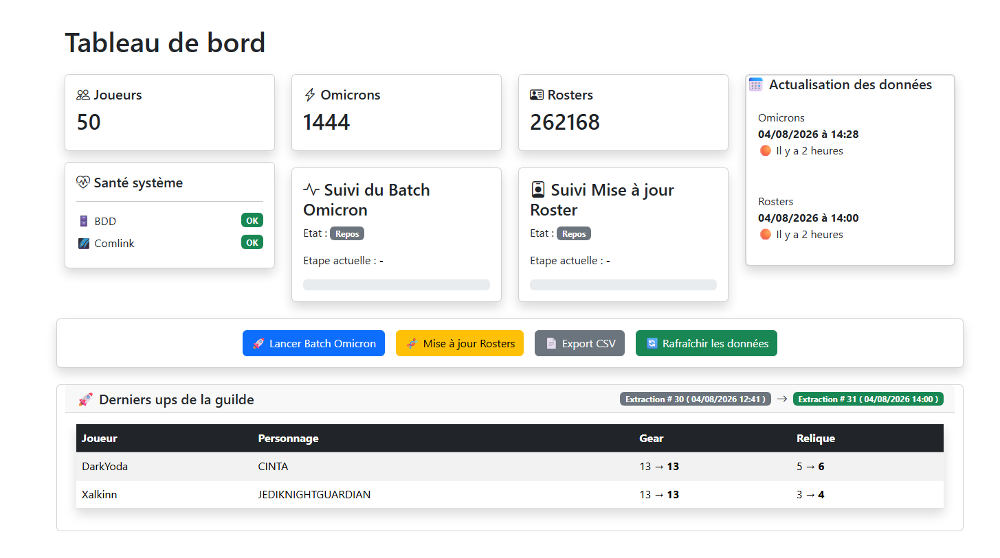
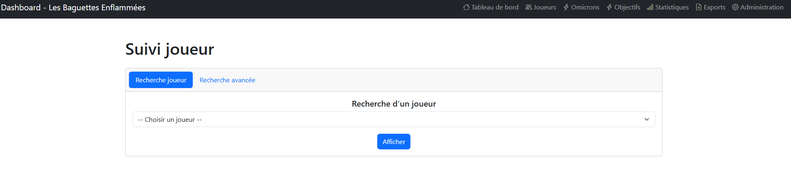
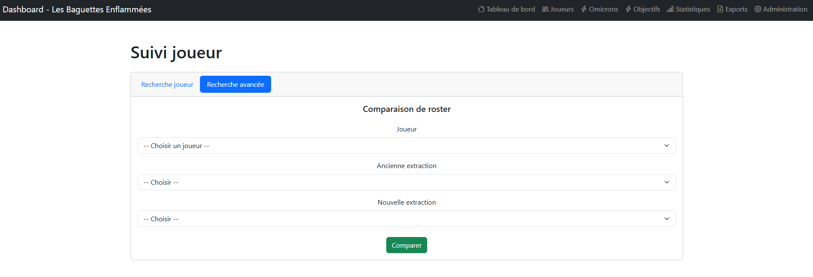
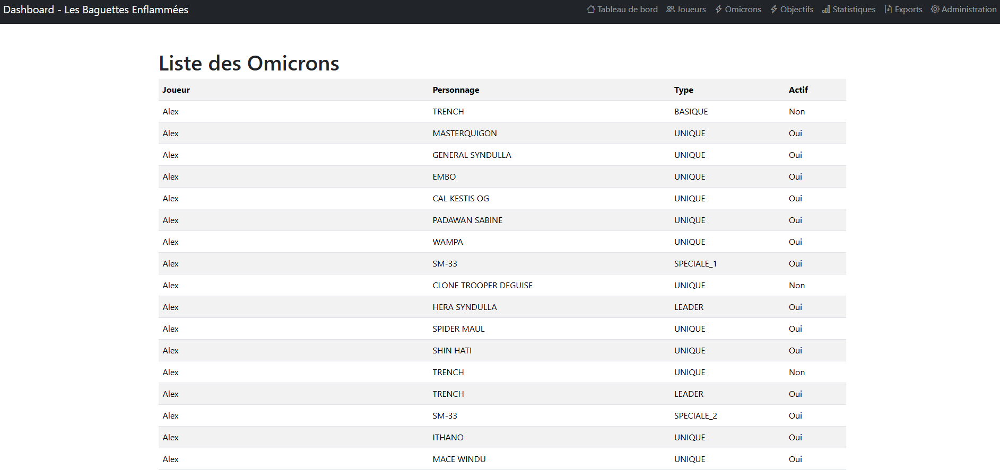
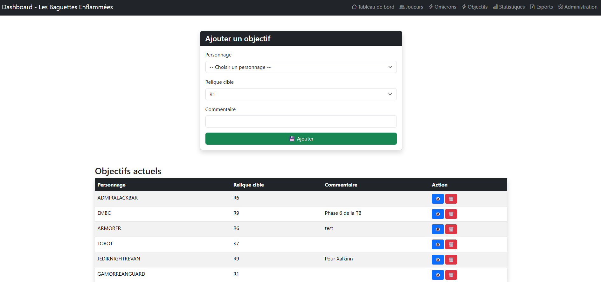

# ⚔️ SWGOH Manager

**SWGOH Manager** est une application web de suivi et de pilotage de guilde pour *Star Wars: Galaxy of Heroes*.  
Elle centralise les données des joueurs d'une guilde (roster, omicrons, progression) extraites via l'API [swgoh-comlink](https://github.com/swgoh-utils/swgoh-comlink), les stocke en base de données et les met en forme dans un tableau de bord web.

Le projet s'appuie sur [`swgoh-comlink-java`](../swgoh-comlink-java), un client Java maison pour l'API swgoh-comlink, utilisé ici comme dépendance pour l'extraction des données.

---

# ✨ Fonctionnalités

- **📊 Dashboard** — vue d'ensemble de la guilde : statistiques globales, état du système, suivi des extractions et derniers personnages améliorés par les membres.
- **👤 Suivi des joueurs** — historique de chaque joueur, recherche simple et comparaison avancée de roster entre deux extractions.
- **🎯 Objectifs personnages** — définition d'objectifs par personnage avec suivi de progression des membres.
- **🔮 Omicrons** — suivi des compétences omicron débloquées par les joueurs de la guilde.
- **⚙️ Batchs asynchrones** — lancement de traitements en arrière-plan pour analyser les omicrons ou mettre à jour les rosters.
- **📄 Export CSV** — export des données *(en cours d'implémentation)*.

---

# 🏗️ Architecture

Le projet suit une architecture Spring MVC classique :

```
Utilisateur
    |
    v
Thymeleaf (templates HTML)
    |
    v
Controllers
    |
    v
Services
    |
    v
Repositories / DAO
    |
    v
MySQL
```

Les données SWGOH sont récupérées via le client Java `swgoh-comlink-java`, puis traitées et enregistrées en base afin de conserver un historique exploitable.

Cette architecture permet notamment :

- le suivi des évolutions de roster,
- la comparaison entre plusieurs extractions,
- l'affichage de statistiques de guilde,
- l'ajout progressif de nouvelles fonctionnalités.

---

# 📦 Gestion des extractions

Chaque récupération de données crée une **extraction historisée**.

Une extraction contient notamment :

- la date de début,
- la date de fin,
- le statut du traitement,
- le nombre de joueurs récupérés,
- le nombre de personnages analysés,
- le nombre d'omicrons détectés.

Ces historiques permettent :

- la comparaison entre deux états d'un roster,
- le suivi de progression d'un joueur,
- l'affichage des derniers personnages améliorés dans la guilde,
- la conservation d'un historique complet des données.

---

# 📊 Aperçu de l'application

## Dashboard

Le tableau de bord fournit une vue globale de la guilde :

- nombre de joueurs,
- nombre d'omicrons,
- nombre de personnages suivis,
- état du système,
- suivi des dernières extractions,
- derniers personnages améliorés.



---

# 👤 Suivi des joueurs

La page joueur permet de consulter l'évolution d'un membre de la guilde.

Deux modes de recherche sont disponibles :

- recherche simple par joueur,
- recherche avancée par comparaison d'extractions.

---

## 🔎 Recherche simple

La recherche simple permet de sélectionner un joueur et d'afficher ses dernières évolutions :

- augmentation de gear,
- progression de relique,
- évolution des étoiles.



---

## 🔍 Recherche avancée

La recherche avancée permet de comparer deux extractions historiques.

Elle permet d'identifier précisément les changements entre deux dates :

- personnages améliorés,
- progression de gear,
- évolution des reliques,
- évolution des étoiles.



---

# 🔮 Suivi des Omicrons

Le module Omicrons permet de suivre les capacités omicron débloquées par les joueurs.

Il permet notamment :

- d'identifier les joueurs possédant certaines capacités,
- suivre la progression de la guilde,
- centraliser les informations issues du batch Omicron.



---

# 🎯 Objectifs de guilde

Le module Objectifs permet de définir des objectifs personnages.

Exemples :

- atteindre une relique donnée,
- monter un personnage spécifique,
- comparer la progression des membres.



---

# 🛠️ Stack technique

| Composant | Technologie |
|-----------|-------------|
| Langage | Java 21 |
| Framework | Spring Boot 4.1 (Web MVC, Data JDBC) |
| Templates | Thymeleaf |
| Base de données | MySQL |
| Build | Maven |
| Données SWGOH | [swgoh-comlink-java](../comlink) |

---

# 🚀 Installation

## Prérequis

- Java 21+
- Maven
- Une instance MySQL accessible
- Le module `swgoh-comlink-java` installé dans votre dépôt Maven local

---

## Configuration

Le fichier :

```
src/main/resources/application.properties
```

contient la configuration de connexion à la base :

```properties
spring.datasource.url=jdbc:mysql://localhost:3333/swgoh?useSSL=false&allowPublicKeyRetrieval=true&serverTimezone=Europe/Paris
spring.datasource.username=root
spring.datasource.password=root
```

> Adaptez l'URL, le port et les identifiants à votre environnement.

---

## Lancement

```bash
git clone https://github.com/Xalkinn/swgoh-manager.git

cd swgoh-manager

./mvnw spring-boot:run
```

L'application démarre par défaut sur :

```
http://localhost:8081
```

---

# 📁 Structure du projet

```
src/main/java/fr/xalkinn/swgohmanager/

├── controleur/     # Contrôleurs Spring MVC
├── service/        # Logique métier
├── repository/     # Repositories Spring Data JDBC
├── dao/            # Accès aux données bas niveau
├── modele/         # Entités et modèles métier
└── dto/            # Objets de transfert de données


src/main/resources/

├── templates/      # Pages Thymeleaf
├── static/         # CSS / JS
└── image/          # Captures utilisées dans la documentation
```

---

# 🗺️ Roadmap

## Fonctionnalités terminées

- [x] Dashboard de suivi de guilde
- [x] Historique des extractions
- [x] Comparaison de roster entre deux extractions
- [x] Recherche simple joueur
- [x] Recherche avancée joueur
- [x] Suivi des omicrons
- [x] Suivi des objectifs personnages
- [x] Affichage des derniers ups de la guilde
- [x] Gestion des batchs avec suivi d'état

---

## À venir

- [ ] Finaliser l'export CSV
- [ ] Ajouter des graphiques de progression
- [ ] Ajouter des statistiques avancées de guilde
- [ ] Ajouter une authentification
- [ ] Gestion multi-guildes

---

# 🔗 Projet lié

- [swgoh-comlink-java](../swgoh-comlink-java) — client Java pour l'API swgoh-comlink (guildes, joueurs, reliques, omicrons), utilisé comme dépendance de ce projet.